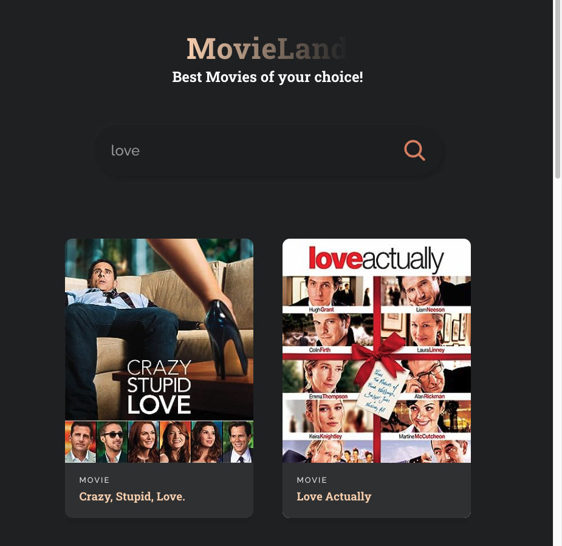

# MovieLand Web App

MovieLand is a simple React-based web application that allows users to search for movies using the OMDB API and display the search results. This README file provides an overview of the project structure and how to set up and run the application locally.

## Table of Contents
- [Prerequisites](#prerequisites)
- [Installation](#installation)
- [Usage](#usage)
- [Project Structure](#project-structure)
- [License](#license)

## Prerequisites
Before you can run MovieLand locally, ensure that you have the following prerequisites installed on your system:
- [Node.js](https://nodejs.org/): You will need Node.js to run the React application.

## Installation
To set up and run the MovieLand web application, follow these steps:

1. Clone the repository to your local machine:

   ```bash
   git clone <repository-url>
   ```

2. Navigate to the project directory:

   ```bash
   cd movies_react
   ```

3. Install the required Node.js packages using npm (Node Package Manager):

   ```bash
   npm install
   ```

## Usage
Now that you have MovieLand installed, you can run the application locally:

1. Start the development server:

   ```bash
   npm start
   ```

2. Open a web browser and go to `http://localhost:3000` to access the MovieLand web application.

3. You can enter a movie title in the search input field and click the search icon to search for movies. The search results will be displayed on the page.

4. Enjoy exploring movies!

## Project Structure
The MovieLand project is structured as follows:

- `App.js`: The main React component that renders the MovieLand application. It includes the search functionality and displays movie results.

- `MovieCard.jsx`: A reusable component for rendering individual movie cards.

- `search.svg`: An SVG icon used for the search button.

- `App.css`: CSS styles for the MovieLand application.


## License
This project is licensed under the MIT License. See the [LICENSE](LICENSE) file for details.

---

Feel free to contribute to this project, report issues, or suggest improvements. Enjoy using MovieLand!